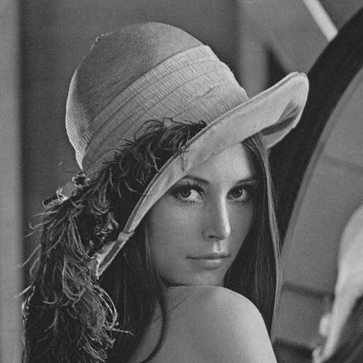
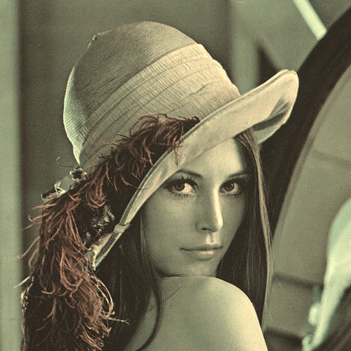
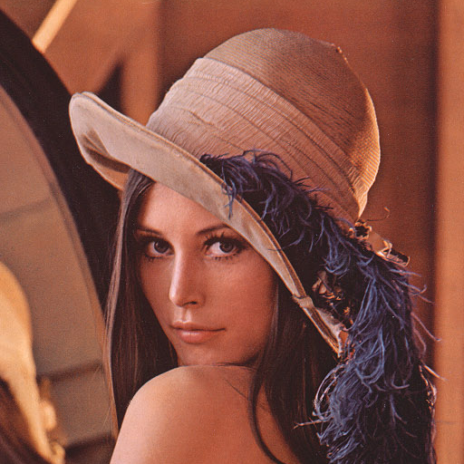
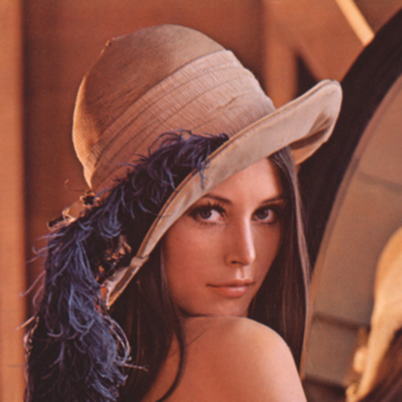

# Image Filtering

Simple C project to apply different filters to BMP images. The different filters are grayscale, sepia, reflection, and blur.

## Usage

To use, compile and run the executable with the following command

```./filter -[flag] [input] [output]```

Where:
- `[flag]` is one of the following:
    - `g` for grayscale
    - `s` for sepia
    - `r` for reflect
    - `b` for blur
- `[input]` is path to the input BMP file
- `[output]` is where the filtered image will be saved

## Example

Original Image:


Filtered Images:

- Grayscale:

  

- Sepia:

  

- Reflect:

  

- Blur:

  

## Building the Project

Compiled using clang and make
